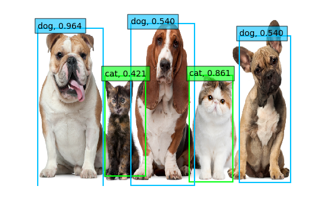
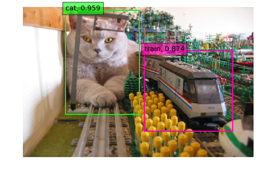

# PyTorch-SSD
[Single Shot MultiBox Detector](https://arxiv.org/abs/1512.02325) in PyTorch.

## Examples

## Requirements
* pytorch 0.2
* opencv-python 3.3
* numpy, tqdm, matplotlib

## Credit
This implementation is heavily inspired by:
* [kuangliu/pytorch-ssd](https://github.com/kuangliu/pytorch-ssd)  
* [amdegroot/ssd.pytorch](https://github.com/amdegroot/ssd.pytorch)  
